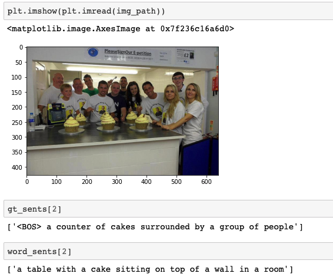

# asg2cap
Simple reimplementation of [asg2cap](https://github.com/cshizhe/asg2cap) by using my pytorch
framework [thexp](https://github.com/sailist/thexp).

> [Paper: Say As You Wish: Fine-grained Control of Image Caption Generation with Abstract Scene Graphs](https://arxiv.org/abs/2003.00387)

> Note: Only core `rgcn.flow.memory` model and greedy decode method tested.


## Train

```shell
git clone --depth=1 https://github.com/thexp/asg2cap
cd asg2cap/asg2cap
python3 trainers/asg2cap.py
```

## Inference

see [dataset_eval.ipynb](asg2cap/dataset_eval.ipynb) for an example



## Dataset construction

### MSCOCO

Please construct your dataset as follows:
```
.
├── annotation
│   ├── controllable
│   │   ├── cleaned_tst_region_descriptions.json
│   │   ├── int2word.npy
│   │   ├── public_split # contains images file names 
│   │   │   ├── trn_names.npy 
│   │   │   ├── tst_names.npy
│   │   │   └── val_names.npy
│   │   ├── regionfiles # record each object ID's img source, might be redundant
│   │   │   ├── trn_names.npy
│   │   │   ├── tst_names.npy
│   │   │   └── val_names.npy
│   │   │   ├── train2014 # 
│   │   │   │   ├── COCO_train2014_000000000009.json
│   │   │   │   ├── COCO_train2014_000000000025.json
│   │   │   │   ├── COCO_train2014_000000000030.json
│   │   │   ├── val2014
│   │   │   │   ├── COCO_val2014_000000000042.json
│   │   │   │   ├── COCO_val2014_000000000073.json
│   │   │   │   ├── COCO_val2014_000000000074.json
│   │   │   │   ├── COCO_val2014_000000000133.json
│   │   │   │   ├── COCO_val2014_000000000136.json
│   │   │   │   ├── COCO_val2014_000000040011.json
│   │   └── word2int.json
├── dir.txt
├── ordered_feature
│   ├── MP
│   │   └── resnet101.ctrl
│   │       ├── trn_ft.npy
│   │       ├── tst_ft.npy
│   │       └── val_ft.npy
│   └── SA
│       └── X_101_32x8d
│           ├── o2
│           │   └── objrels
│           │       ├── train2014_COCO_train2014_000000000036.jpg.hdf5
│           │       ├── train2014_COCO_train2014_000000579757.jpg.hdf5
│           │       ├── train2014_COCO_train2014_000000579785.jpg.hdf5
│           │       ├── val2014_COCO_val2014_000000000042.jpg.hdf5
│           │       ├── val2014_COCO_val2014_000000000073.jpg.hdf5
│           │       ├── val2014_COCO_val2014_000000000133.jpg.hdf5
│           └── objrels
│               ├── train2014_COCO_train2014_000000000009.jpg.hdf5
│               ├── train2014_COCO_train2014_000000581909.jpg.hdf5
│               ├── train2014_COCO_train2014_000000581921.jpg.hdf5
│               ├── val2014_COCO_val2014_000000000074.jpg.hdf5
│               ├── val2014_COCO_val2014_000000000139.jpg.hdf5
│               └── val2014_COCO_val2014_000000581929.jpg.hdf5
└── results
    
```

### json file construction

Each region in each figure will have a `region_id`, and the `region_graph` can be obtained by `region_id`.

Each `region_graph` will have multiple object(in `objects` key), relationship(in `relationships` key), but one `phrase`(
sentence).

Each object in `objects` contains its `object_id`, bounding box(recored by `x`,`y`,`w`,`h`), `name`(word or phrase
string), and some `attributes`(each attribute is a string)

Each relationship in `relationships` contains its `relationship_id`, `name`, and its relted `subject_id` and `object_id`
, the region bounding box can be generated by union region of subject and object.

```json
{
  "515385": {
    // region id
    "objects": [
      {
        "object_id": 1639311,
        "name": "boy",
        "attributes": [
          "small"
        ],
        "x": 245,
        "y": 182,
        "w": 115,
        "h": 173
      },
      {
        "object_id": "",
        ...
      },
      ...
    ],
    "relationships": [
      {
        "relationship_id": 867254,
        "name": "on",
        "subject_id": 1639311,
        "object_id": 1639310
      },
      {
        "relationship_id": ...,
        "name": "on",
        "subject_id": 1639311,
        "object_id": 1639312
      }
    ],
    "phrase": "a small boy on some grass and a frisbee"
  },
  "407180": {
    "objects": [
      {
        "object_id": 1639311,
        "name": "boy",
        "attributes": [
          "small"
        ],
        "x": 245,
        "y": 182,
        "w": 115,
        "h": 173
      },
      {
        "object_id": 1639310,
        "name": "grass",
        "attributes": [],
        "x": 91,
        "y": 158,
        "w": 545,
        "h": 242
      },
      {
        "object_id": 1639312,
        "name": "frisbee",
        "attributes": [],
        "x": 286,
        "y": 236,
        "w": 123,
        "h": 75
      }
    ],
    "relationships": [
      {
        "relationship_id": 867254,
        "name": "on",
        "subject_id": 1639311,
        "object_id": 1639310
      },
      {
        "relationship_id": 867255,
        "name": "on",
        "subject_id": 1639311,
        "object_id": 1639312
      }
    ],
    "phrase": "a small boy on some grass and a frisbee"
  }
}


```


## Question

- Relations bounding box generation method might be wrong?
- Model tend to be overfitting train dataset during training process.